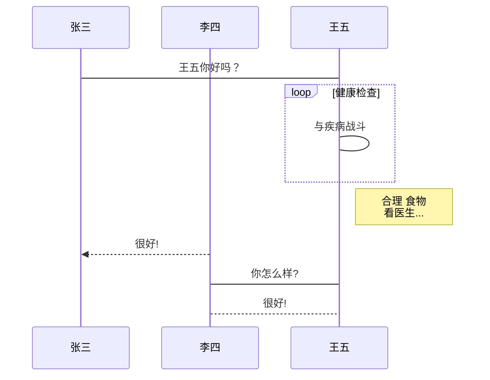

# 学习markdowns

## 技能知识点

### 标题

使用# 进行标题的划分 ， 可以分为6级 ， 对于一个非论文级别的轻量级文档来说这个层级已经完全够用了。

### 段落格式

#### 段落  

新的段落使用两个空格加换行来表示  
也可以直接使用空行来表示

#### 字体

使用*符号来表示：  
*斜体*  
**加粗**  
***斜体加粗***  
分别对应1 - 3 个*号

#### 分割线

使用三个*表示分割线
***

#### 删除线

使用两个～符号来表示文字被删除： 例如 ~~待删文字~~

#### 下划线

<u> 需要带下划线的文字</u>

#### 脚注

下面这段文字演示如何进行脚注[^使用特殊的符号进行]
[^使用特殊的符号进行]: 脚注的具体内容信息  

### 列表

分为无序列表和有序列表两类， 无序列表使用 * + - 三个符号都可以表示列表项 。 有序列表使用数字加.符号来表示  
列表之间的嵌套采用的是加四个空格键 来区分

### 区块

> 在段落的开头加上>加一个空格来表示区块 ， 应该是为了弄的更好看吧  
> > 另外值得一提的是区块可以嵌套在列表中

### 代码  

在段落中使用两个‘符号将代码包起来， 代码区使用'''三个符号表示
比如本段代码中的`std::cout<<"hello world" ;`

``` c++
#include<iostream>
using namespace std;
int main(){
    cout<<"hello world"<<endl ;
    return 1 ;
}
```

### 图片


~~这个等具体使用的时候再研究~~

### 链接

[链接名称](链接地址)

或者

<链接地址>

可能使用都比较少 ， 不深究。

### 表格

Markdown 制作表格使用 | 来分隔不同的单元格，使用 - 来分隔表头和其他行。

语法格式如下：

|  表头   | 表头  |
|  -  | -  |
| 单元格  | 单元格 |
| 单元格  | 单元格 |
以上代码显示结果如下：

对齐方式我们可以设置表格的对齐方式：

-: 设置内容和标题栏居右对齐。
:- 设置内容和标题栏居左对齐。
:-: 设置内容和标题栏居中对齐。
实例如下：`

| 左对齐 | 右对齐 | 居中对齐 |
| :-----| ----: | :----: |
| 单元格 | 单元格 | 单元格 |
| 单元格 | 单元格 | 单元格 |

## 其它复杂的绘图功能

### 流程图

```flow
st=>start: 开始框
op=>operation: 处理框
cond=>condition: 判断框(是或否?)
sub1=>subroutine: 子流程
io=>inputoutput: 输入输出框
e=>end: 结束框
st->op->cond
cond(yes)->io->e
cond(no)->sub1(right)->op
```

### UML时序图



### 甘特图

~~好像一般的不支持，我也没怎么用到， 暂不深究~~

## 工具

1. vscode  中的插件： markdown preview enhance
2. typora 工具
